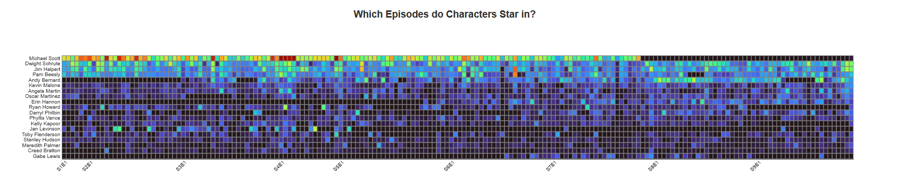
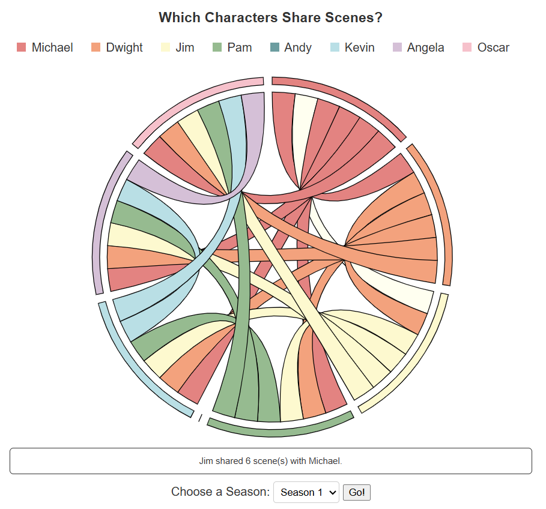
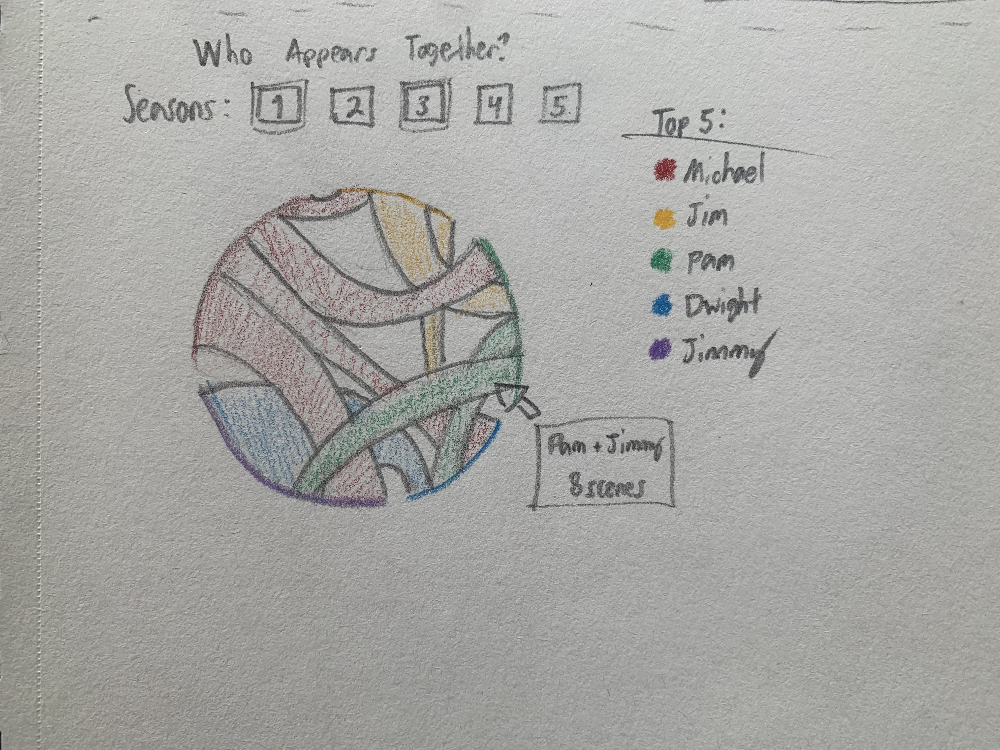
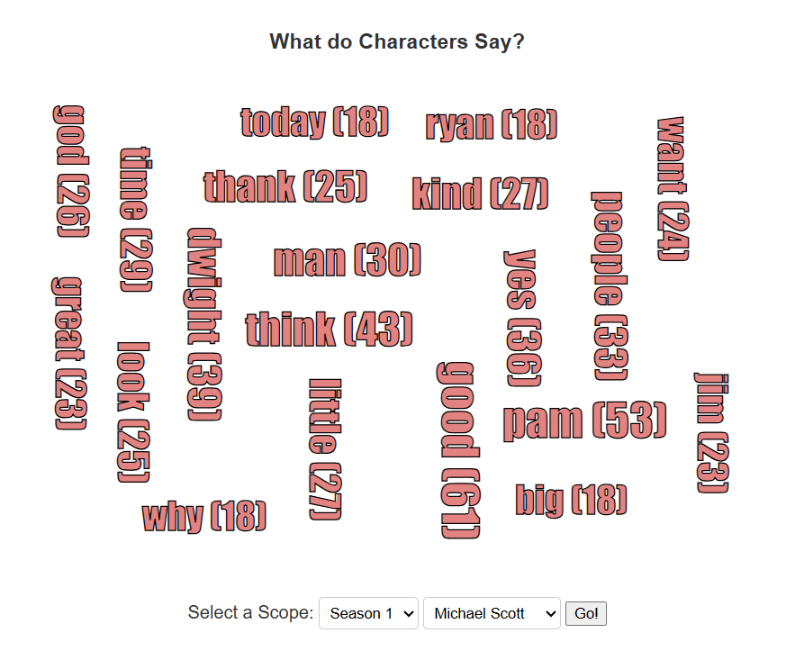
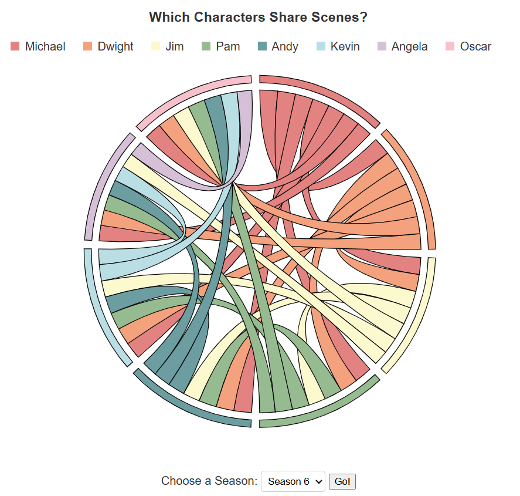

# Visual_Interfaces_Project_3
by Nathan Suer, Caleb Copley, and Ryan Williams

Hosted website/application: https://nsuer.github.io/Visual_Interfaces_Project_3/

Code/Github: https://github.com/NSuer/Visual_Interfaces_Project_3

## Motivation
The motivation for this application is to provide fans of *The Office* with an interactive dashboard to explore and analyze data from the show. By visualizing dialogue, character interactions, and other patterns, users can gain insights into the series. This tool allows users to engage with the show in a new way, uncovering trends and details that may not be immediately apparent from simply watching the episodes.

## Data
Our data was semi-messy, all things considered. We obtained it from the reddit link below and had to do a lot of preprocessing. One major issue that I ran into was mistranslation and puncuation deletion issues. I spent around 10 hours manually identifying where punctuation was placed with a unicode diamond. Other than that, the data required simple reprocesses for certain functions.
https://www.reddit.com/r/datasets/comments/b30288/every_line_from_every_episode_of_the_office/

## Visualization Components (Including Design Justification and Sketches)

### Heatmap

The heatmap visualizes the number of lines spoken by each character in every episode of *The Office*. The X-axis represents the episodes, while the Y-axis lists the characters. The color intensity of each cell indicates the number of lines spoken, with red representing the highest number of lines and transitioning to purple/black for fewer or no lines.

#### Features:
- **Tooltips**: Hovering over a cell displays detailed information, including the character's name, season, episode, and the number of lines spoken in that episode.
- **Character Insights**: Hovering over a character's name on the Y-axis reveals their total number of episodes and lines across the series.
- **Interactive Links**: Clicking on a character's name on the Y-axis redirects to their corresponding wiki article for further exploration.

#### Interaction:
Users can interact with the heatmap to uncover patterns and trends in character dialogue. For example:
- Identify which characters dominate specific episodes or seasons.
- Explore how dialogue distribution changes over time.
- Gain quick access to additional character information via the wiki links.

The heatmap dynamically updates based on user interactions, providing an engaging and insightful way to analyze the show's dialogue data.

#### Design Sketches and Design Justifications
Although no sketches were created for the heatmap, the decision to use this visualization was because it could effectively complete the goals outlined for Level 1. The heatmap provides a clear and intuitive way to explore the importance of different characters in *The Office* by visualizing their dialogue distribution across episodes and seasons.

**Justification for Using a Heatmap:**
- **Overview of the Show:** The heatmap offers a comprehensive overview of character appearances and dialogue intensity across all episodes, helping users understand the show's structure and character dynamics.
- **Character Importance:** By visualizing the number of lines spoken by each character, users can easily identify major and minor characters based on their dialogue contributions.
- **Episode and Season Insights:** The heatmap allows users to drill down into specific episodes or seasons, revealing how much each character speaks and when they appear.
- **Interactive Features:** Tooltips, character insights, and clickable links to character wiki pages enhance the user experience by providing additional context and details on demand.

This visualization aligns with the Level 1 requirements by enabling users to:
- Identify the most important characters based on their dialogue contributions.
- Explore character appearances and dialogue trends across the entire series or within specific seasons.
- Gain quick access to external resources for further exploration of characters.

The heatmap's design ensures that users can accomplish these tasks efficiently while maintaining an engaging and visually appealing interface.

### Chord
The chord graph showcases which characters appear in scenes together. Each arc on the outer ring represents a character's breadth of scene appearances, with chords connecting parts of arcs representing shared scenes. 

I chose to represent character adjacency with a chord diagram, as the data behind the scenes is an actual adjacency matrix, which is the format required by a chord graph. Getting the data postprocessed into that matrix took quite a bit of time, but I felt it was a very intuitive way to structure the data. A chord graph in particular highlights connection out of a whole, and the width of both ends of the chord gives additional info: how much of a character's arc is part of itself. 

By mousing over a chord, you can see it highlighted in off-white, as well as an infobox with data on the involved characters, as well as the number of scenes shared.

One can also select which season to visualize. The transition is very snappy, which I was happy with. 

This sketch was from initial ideation, detailing how I wanted the graph to look in a rainbow color palette. That palette ended up being more pastel, as it was easier on the eyes, but otherwise the sketch translated almost 1:1 to the final implementation.

I used the following linked tutorial as a starting point for this graph. Features like arc highlighting and season selection were entirely my own. https://d3-graph-gallery.com/graph/chord_interactive.html

### Word Cloud
The wordcloud displays the notable words that characters speak the most in a given season, as well as the number of times those words are spoken. 

I chose to represent common words with a wordcloud, as it's a text-focused graph that is concrete in what it presents. Anyone can read it and understand, as it surfaces only what they need to see.

The user can select one character and one season. With those filters in place, the resultant wordcloud shows the top 20 words by frequency. A long list of stop-words were excluded to give more variety to the final results, focusing on character-specific words. 

By clicking the "Go!" button again without changing your selections, you can regenerate the graph if you don't like its current rotation of words.

The color legend from the chord graph is preserved here, giving a sense of continuity between the neighboring graphs.

I used a tutorial to help with creating the graph itself after post-processing the data. There was more to it, namely incorporating this design into an object-oriented project structure, as well as including the scope selectors, but this was a very helpful start.
Link here: https://d3-graph-gallery.com/graph/wordcloud_size.html

### Interaction Language Index
For our "Choose-Your-Own-Adventure" prompt, we made something called the interaction language index. The index measures what words a character says when another character is in the room. For example, what are the most common words in dwight's vocab but only in situations where Michael is in the room. It is a d3 simulation that uses data processed by python files and auto-compiles each characters scene lines into 1 data point. As a result, the function reads all scenes and creates a dictionary for "what has _ said when _ is around?" The top 20 words from each were grabbed in particular. We also limited it to 7 characters for readability.

## What the application enables you to discover
By analyzing the heatmap, users can identify which characters dominate specific episodes or seasons. For example, Michael Scott has the highest dialogue intensity in earlier seasons, while Dwight Scrute, Jim Halpert, and Pam Beesly take on more prominent roles in later seasons.

We learn from the chord graph that most characters share almost-equal numbers of scenes during the show. There are some instances where this isn't true, for example Michael isn't present for the last 2 seasons save for his closing 2 lines, and in season 3, Oscar has notably few lines, increasing to the average over seasons 4 and 5. 

From the wordcloud, we can see the variances in how people speak in general, including to the camera. Dwight, for example, said his own name 13 times in season 4, and was the only character to have their name rank on their own filtered top 20. Given that he's very self-important, it makes sense, and makes one wonder if he was referring to himself in the third-person.

By analyzing the interaction graph, someone can see the diction a character uses when another is around. Word choice lends well to tone so the user can idenfity a lot of commonalities.

## Process

### Libraries Used
We utilized D3 for creating interactive and dynamic visualizations such as the heatmap, chord diagram, and word map.

For the wordcloud, a separate library was used. It was designed to work with d3, filling in for the base library's lack of a wordcloud. 
You can find it here: https://github.com/jasondavies/d3-cloud

### Code Structure
The project is structured as follows:
- **`/data`**: Contains the raw dataset and any preprocessed data files.
- **`/js`**: Contains JavaScript files for creating visualizations and handling user interactions.
- **`index.html`**: The main HTML file that serves as the entry point for the application.

### How to Access and Run the Application
You can access the application by visiting the hosted website at [https://nsuer.github.io/Visual_Interfaces_Project_3/](https://nsuer.github.io/Visual_Interfaces_Project_3/). The application is designed to be user-friendly and does not require any additional setup or installation.

You can also run the application locally by cloning the GitHub repository and hosting it on a local server. The code is at [https://github.com/NSuer/Visual_Interfaces_Project_3](https://github.com/NSuer/Visual_Interfaces_Project_3)

## Demo Video
Please find our demonstration video here: https://youtu.be/xkduvqXO-CY

## Who did what
- Nate: Found the dataset, created the heatmap, and wrote part of the README / Documentation.
- Caleb: Data pre-processing, Created the interaction language index, and wrote part of the README / Documentation.
- Ryan: Created the chord diagram, word map, and wrote part of the README / Documentation.

## AI use
- Nate: 
    - uses github copilot to help with code completion and debugging. More of an auto-complete tool than a code generator.
    - used github copilot to help with writing the README and documentation. I would give the instructions from the assignment and it would help me write the text. I would then edit it to make it more personal and fit my style. For example: "write a section on the heatmap. Explain each view of the data, the GUI, etc.  Explain how you can interact with your application, and how the views update in response to these interactions. The heatmap is a heatmap with the lines per episode for every episode in the series. The Y axis is charachters and the X axis is epiisodes. Color is based on how many lines they spoke. Red is the most lines spoken in an episode , it then goes on a gradient to purple/black whick is little to no lines. There is tooltips too. If you hover over the cells in the heatmap it will give you the charachter, season and episode, and amount of lines in that episode. If you hover over a charachter on the y axis you get the charachters name, the amount of episodes they are in, and thew amouunt of lines they have in the entire series. You can also click on a charachter on the y axis and it will link to the wiki article for the charachter "

- Ryan: 
    - Some minor use cases in which I would give ChatGPT a code snippet and ask where my syntax was off.

- Caleb:
    - uses github copilot for completion and debugging. Used it to generate easier examples of d3 simulations. I also used it to make minor changes right before the presentation (clarity edits). Also used github copilot to help smooth out the connections between code sections to make up for my lack experience with certain js/html conventions.